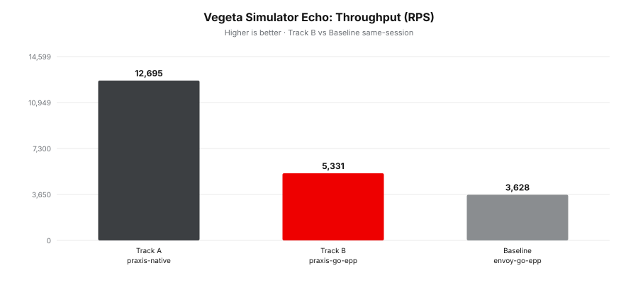
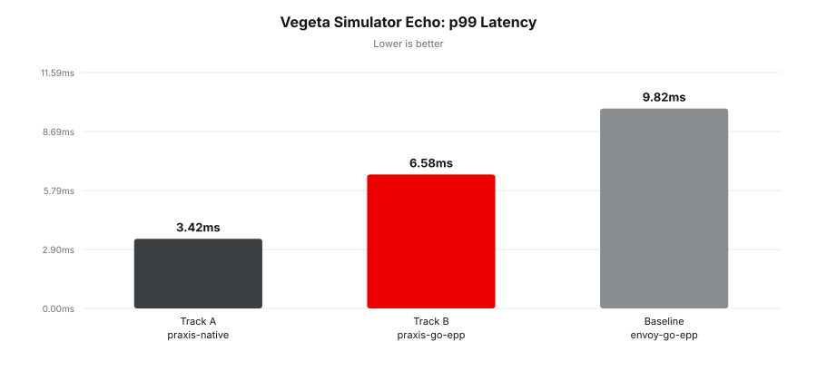
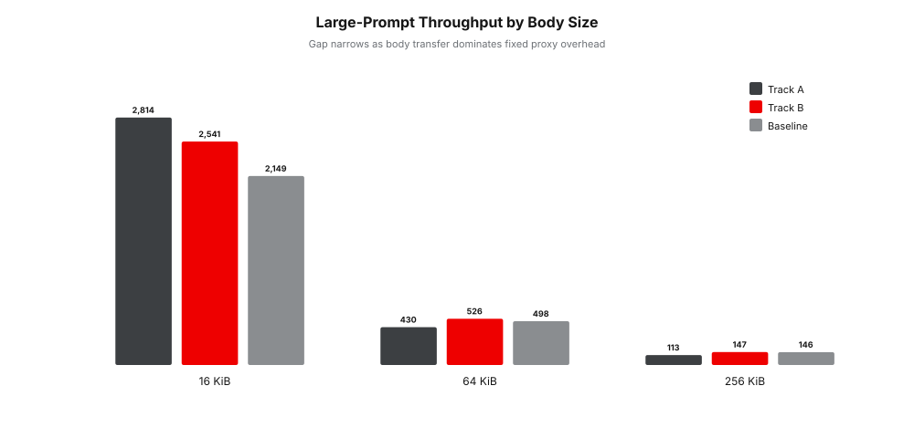
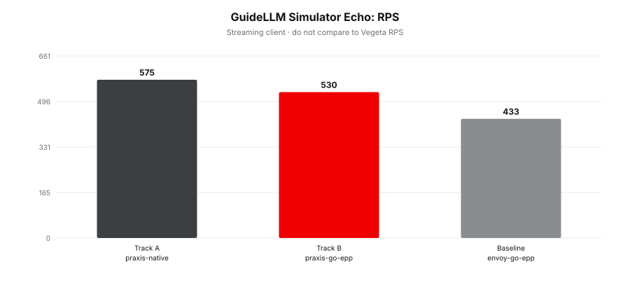

# llm-d Performance Benchmark Results

> **Disclaimer:** All results below are from a single-node development
> environment using `llm-d-inference-sim` in echo mode without GPU inference.
> These are not validated production performance claims.

---

## Profiles Compared

| Role | Profile | Request path |
|---|---|---|
| Track A | `praxis-native` | Client -> Praxis `llmd_endpoint_picker` -> selected backend |
| Track B | `praxis-go-epp` | Client -> Praxis `llmd_external_epp` -> Go EPP -> selected backend |
| Baseline | `envoy-go-epp` | Client -> Envoy `ext_proc` -> Go EPP -> selected backend |

---

## How To Read These Results

Each table has exactly three rows: Track A, Track B, and the Baseline.
All rows were collected on the same host in the same run window using the
same simulator and methodology. The EPP profiles (`praxis-go-epp` and
`envoy-go-epp`) used the same Go EPP binary; Track A does not use Go EPP.

## Run Metadata

| Item | Value |
|---|---|
| Track A Praxis commit | `84b4241` (branch `e2e-llm-d-epp-benchmarking`) |
| Track B benchmark worktree | `52f0bfb` (branch `track-b-benchmarking`; implementation base includes `e881dc9`) |
| Go EPP binary | `llm-d-router` at `bbaff6ff` |
| Simulator | `llm-d-inference-sim` echo mode |
| Vegeta | v12.12.0, rate 0, max-workers 16 |
| GuideLLM | v0.6.0, concurrent profile, concurrency=4 |
| CPU | Intel Xeon E5-2686 v4 @ 2.30GHz |
| OS | Linux 6.14.0-1018-aws |
| Run date | 2026-06-08 |

Raw artifacts:

- Track A benchmark worktree: `target/criterion/`
- Track B benchmark worktree: `target/criterion/`

---

## Vegeta: Simulator Echo

**Methodology:** 3 runs x 30s, 5s warmup, Vegeta rate 0, max-workers 16, median.

**Backend:** `llm-d-inference-sim` echo mode, model `test-model`.

| Role | Profile | RPS | p50 | p95 | p99 | Success |
|---|---|---:|---:|---:|---:|---:|
| Track A | `praxis-native` | 12,726 | 1.02ms | 2.32ms | 3.42ms | 100% |
| Track B | `praxis-go-epp` | 5,230 | 2.80ms | 5.09ms | 6.58ms | 100% |
| Baseline | `envoy-go-epp` | 3,586 | 4.10ms | 7.62ms | 9.82ms | 100% |

**Summary:** Track A is the fastest path on the small simulator echo workload.
Track B is clearly ahead of the Envoy baseline while still calling the same
Go EPP scheduler as Envoy.

> **Track A vs Baseline:** `praxis-native` is **3.55x higher throughput**
> and has **2.87x lower p99** than `envoy-go-epp`. Track A removes the
> Go EPP entirely — scheduling runs in-process with no gRPC hop.

> **Track B vs Baseline:** `praxis-go-epp` is **1.46x higher throughput**
> and has **1.49x lower p99** than `envoy-go-epp`. Both call the same
> Go EPP over gRPC — the difference is Praxis vs Envoy at the proxy edge.

> **Track A vs Track B:** `praxis-native` is **2.43x higher throughput**
> than `praxis-go-epp`. The gap is the ext_proc gRPC round-trip that
> Track B pays on every request.

**Analysis:** This is the workload where fixed proxy and scheduler overhead is
most visible because the simulator echo backend returns quickly. Track B and
the Envoy baseline both call Go EPP, so their 1.46x throughput gap isolates the
proxy/runtime difference between Praxis and Envoy. Track A removes the external
EPP process entirely, so the 12,726 RPS result is consistent with the expected
architecture ordering: in-process scheduling first, external EPP through Praxis
second, external EPP through Envoy third.

---

## Vegeta: Large-Prompt Body Handling

**Methodology:** 3 runs x 30s, 5s warmup, Vegeta rate 0, max-workers 16, median.

**Backend:** `llm-d-inference-sim` echo mode.

| Role | Profile | 16 KiB RPS / p99 | 64 KiB RPS / p99 | 256 KiB RPS / p99 |
|---|---|---:|---:|---:|
| Track A | `praxis-native` | 2,814 / 12.16ms | 430 / 84.74ms | 113 / 232.68ms |
| Track B | `praxis-go-epp` | 2,541 / 12.99ms | 526 / 47.22ms | 147 / 148.17ms |
| Baseline | `envoy-go-epp` | 2,149 / 16.17ms | 498 / 49.15ms | 146 / 147.17ms |

**Summary:** Larger request bodies compress the differences between profiles.
Track B remains ahead of the Envoy baseline at 16 KiB and 64 KiB, but the
256 KiB results are effectively tied.

> **Track B vs Baseline ratio by prompt size:**
>
> | Prompt | Track B RPS | Baseline RPS | Ratio |
> |---|---:|---:|---:|
> | 16 KiB | 2,541 | 2,149 | **1.18x** |
> | 64 KiB | 526 | 498 | **1.06x** |
> | 256 KiB | 147 | 146 | **1.01x** |

The ext_proc gRPC overhead is a fixed per-request cost. At 16 KiB, the
body transfer takes real time but the proxy hop is still visible. At
256 KiB, body transfer completely dominates and all profiles converge.

**Analysis:** The Track B advantage falls from 1.18x at 16 KiB to 1.01x at
256 KiB, which shows that body movement dominates once the payload is large
enough. Track A is strongest at 16 KiB, but at 64 KiB and 256 KiB its measured
p99 is higher than the other profiles in this benchmark. That means the large-body
result should be read as a body-handling stress case, not a general statement
that one architecture is always lower latency at every payload size. The useful
takeaway is narrower: Track B does not regress badly against Envoy as body size
grows, and all paths converge when transfer cost dominates routing overhead.

---

## GuideLLM: Simulator Echo

**Methodology:** GuideLLM concurrent profile, concurrency=4, 30s.

**Backend:** `llm-d-inference-sim` echo mode.

| Role | Profile | RPS | TTFT median | ITL median |
|---|---|---:|---:|---:|
| Track A | `praxis-native` | 576 | 2.69ms | 0.015ms |
| Track B | `praxis-go-epp` | 476 | 4.08ms | 0.017ms |
| Baseline | `envoy-go-epp` | 394 | 5.88ms | 0.025ms |

**Summary:** GuideLLM preserves the same ordering as the simulator echo Vegeta
test: Track A first, Track B second, Envoy baseline third. Track B improves both
RPS and TTFT relative to the Envoy baseline.

> **Track B vs Baseline:** `praxis-go-epp` is **1.21x higher RPS** and
> has **1.44x lower TTFT** than `envoy-go-epp`.

> **Track A vs Baseline:** `praxis-native` is **1.46x higher RPS** and
> has **2.19x lower TTFT** than `envoy-go-epp`.

GuideLLM RPS is lower than Vegeta because it processes streaming responses
token by token. TTFT and ITL are shallow in echo mode — meaningful only
with simulated inference latency or real GPU backends.

**Analysis:** GuideLLM is a different client model than Vegeta, so the absolute
RPS numbers should not be compared across tools. Within this GuideLLM run,
Track B's 476 RPS and 4.08ms median TTFT show the same benefit over
Envoy as the Vegeta tests. The TTFT gap is useful as a request-path signal in
echo mode, but it is not a real generation-latency claim because the backend
does not perform GPU inference.

---

## Claim Boundaries

- All results are **request-path overhead**, not GPU inference performance.
- Track B does **not** remove the Go EPP. It replaces Envoy with Praxis.
- The simulator echo backend returns instantly — results measure proxy and
  scheduler overhead, not model serving latency.
- The full llm-d API Gateway, Gateway API controllers, Kubernetes CRDs,
  `llm-d-deployer`, InferencePool reconciliation, and real vLLM/SGLang
  workers are not part of these benchmarks.
- Production claims require isolated hardware and real model-serving backends.
