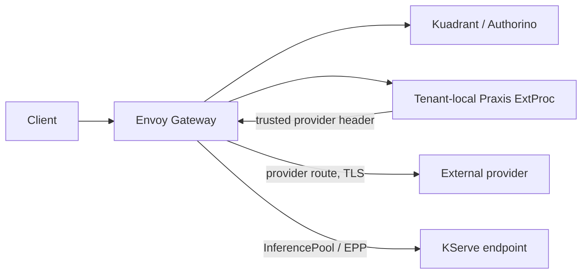
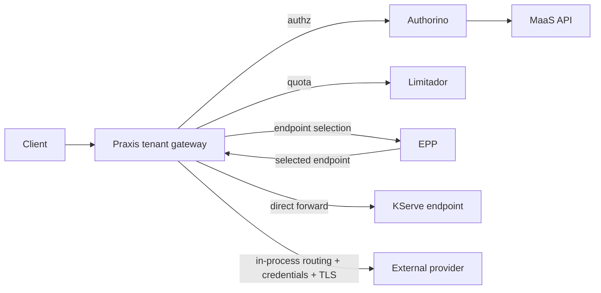
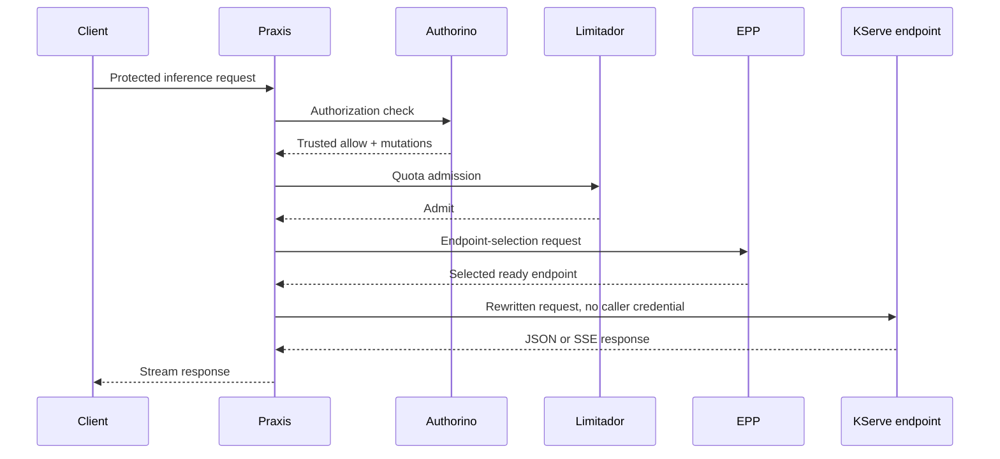
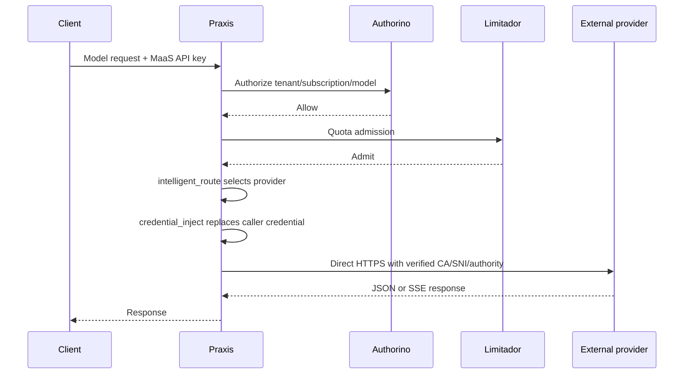
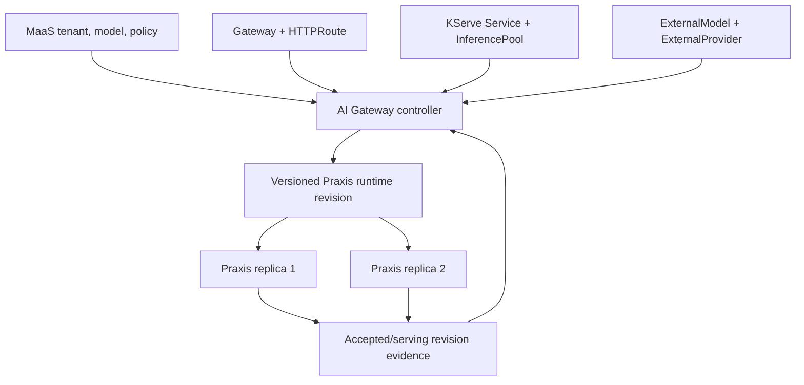

# MaaS/Praxis V3 Dataplane Research Spike

**Status:** architecture and research direction, September 2026. This is a stab at trying to find any potential future landmines. 

> Anything in this doc that sounds authoritative, is the model and probably not intended in most cases. This is simply presenting what I've seen working on an end to end PoC with a basic understanding of the v3 integration.

## Summary

V3 makes Praxis the tenant-facing HTTP/TLS proxy and the component that opens
the final connection to a KServe endpoint or external model provider. Envoy is
not on either V3 inference request path. The separate ExtProc hop also
disappears in V3 because the relevant Praxis AI filters execute in the Praxis
process. This is a data-plane change, **not** a replacement of the MaaS product
control plane.

MaaS continues to own tenants, API keys, subscriptions, model entitlement,
policy intent, and management APIs. The first migration should keep Authorino
and Limitador authoritative and make Praxis consume their decisions through
maintained, fail-closed adapters. Replacing those engines with Praxis-native
policy or token limiting is a separate parity program.

For KServe, Praxis must implement the Gateway API and InferencePool/EPP
data-plane contract, including endpoint selection and truthful route status.
For ExternalModels, Praxis can reuse the established provider resolution,
overlay, and credential-projection concepts, but must own TLS, authority,
credential injection, and final forwarding itself. The same tenant Praxis
gateway must serve both classes without policy or credential crossover.

## Scope and Non-Goals

**In short:** This phase changes who handles inference traffic. It does not
change how customers create keys, subscribe to models, or manage tenants.

The first product milestone covers:

- One tenant Praxis gateway handling MaaS management and protected inference
  routes.
- Existing MaaS API-key, subscription, model-entitlement, and quota contracts.
- Ordinary KServe Service routes and scheduler-backed InferencePool routes.
- ExternalModel provider selection and direct HTTPS forwarding.
- Two Praxis replicas, shared quota state, streaming, configuration updates,
  readiness, isolation, and rollback to the existing Envoy mode.

It does **not** initially require replacing Authorino, Limitador, MaaS APIs,
KServe APIs, or the Gateway API Inference Extension. Grid/regional routing,
weighted policy evolution, shared multi-tenant Praxis fleets, and native
Praxis tokenomics are later work.

## Current and Target Topology

**In short:** Today Envoy still makes the final connection. In V3, Praxis
receives the request and makes that connection itself.

The merged ExternalModel integration removed the old standalone Praxis
forwarding hop, but still relies on Envoy for the provider connection. It is
not V3.



The V3 target is:



There is no Envoy or standalone ExtProc in either selected V3 inference path.
An Envoy deployment may remain available during migration for rollback; its
mere presence in the cluster must not be confused with being on the request
path. Record the actual client Service endpoint, upstream connection, and
request trace when qualifying V3.

## Responsibilities

**In short:** MaaS continues to decide who may use which model. The controller
turns that intent into configuration, and Praxis serves the request.

| Component | V3 responsibility |
| --- | --- |
| MaaS API/controller | Tenant, API-key, subscription, model and policy lifecycle; management endpoints. |
| AI Gateway controller | Compile Gateway, KServe and ExternalModel desired state into a coherent Praxis runtime revision; own its generated resources and status. |
| Praxis core | Frontend listener/TLS, HTTP routing, streaming, generic external-authz and quota transports, upstream connections and reload safety. |
| Praxis AI | In-process inference routing, EPP integration where AI-specific, provider credential injection and token-usage extraction. |
| Authorino | Existing caller authentication and model/subscription authorization during initial migration. |
| Limitador | Existing distributed MaaS quota authority during initial migration. |
| KServe | LLMInferenceService, serving workloads, generated route and InferencePool intent. |
| EPP | Select an eligible inference endpoint for a pool-backed request. |
| AI Gateway operator | Package images, settings, RBAC and the reversible data-plane selection. |

Only one controller should publish each Praxis runtime configuration. KServe
continues to own its workload and the resource status portions assigned to it;
the Praxis Gateway controller owns the Gateway/HTTPRoute status for the Gateway
it implements. MaaS must not directly write Praxis configuration.

## Request Processing Order

**In short:** A request must pass identity, model-access and quota checks
before Praxis asks EPP or contacts any model or provider.

The order is a security contract, not merely a preferred filter layout:

```text
frontend TLS and route recognition
  -> authenticate caller
  -> authorize tenant, subscription and client-visible model
  -> reserve/check quota
  -> select KServe endpoint or ExternalModel provider
  -> replace/strip credentials and internal headers
  -> open backend/provider connection
  -> stream response and account for usage
```

Anonymous, invalid, revoked, unentitled, or quota-denied traffic must not
contact EPP, KServe, or an external provider. A caller-supplied model,
subscription, provider-selection, endpoint-selection, or authenticated-subject
header must never become trusted state simply because it is present. Preserve
trusted identity in request-local typed metadata where possible.

The MaaS client credential must be removed before any upstream contact. A
KServe backend sees no caller `Authorization`; an ExternalModel provider sees
only its projected provider credential, not the MaaS API key or a caller
`x-api-key` override.

## MaaS Policy Compatibility

**In short:** Keep the existing MaaS policy engines at first. Praxis needs to
ask them the same questions Envoy asks today and honor the same answers.

MaaS-generated policy objects currently target the Kuadrant/Envoy ecosystem.
Attaching an AuthPolicy or TokenRateLimitPolicy to a Praxis Gateway cannot be
assumed to enforce it. V3 needs an explicit controller-to-dataplane bridge:

1. Translate the generated policy attachment and route context without
   changing MaaS's user-facing API-key/subscription model.
2. Make Praxis call unmodified Authorino using the exact request attributes
   and honor its allow/deny, status/body, header additions/removals, metadata,
   timeout, cache and failure semantics.
3. Make Praxis apply the matching Limitador decision using a trusted
   tenant/subscription/model descriptor, not a client header.
4. Ensure management/discovery routes and inference routes retain their
   distinct authorization rules.
5. Fail closed when a required policy cannot be resolved, configured, or
   reached. Never make a new route public merely because translation failed.

A generic Praxis policy filter or Basic Auth filter is not automatically a
replacement for MaaS's Authorino contract. Likewise, Praxis AI's
`token_rate_limit` filter is experimental and is not currently established as
equivalent to MaaS-generated Limitador policy. Its Valkey-backed shared bucket
is useful research, but does not by itself prove MaaS token reservation,
settlement, outage, or policy-update parity.

V3 requires maintained Authorino and Limitador adapters driven by generated
MaaS policy. A manually configured intermediary does not provide a durable
policy lifecycle or establish product parity.

### Quota detail

Request-count admission and token accounting are separate gates. V3 must
measure the current shipped Kuadrant/Limitador behavior, then preserve:

- Shared counters across Praxis replicas and isolation by trusted subject,
  subscription, tenant and model as specified by MaaS.
- Denial before EPP or provider contact, with compatible 429 status and
  response headers.
- The actual token-use contract, including reservation before forwarding,
  settlement after response, streaming usage, retries, disconnects and
  duplicate settlement, **if** the upstream policy supports those operations.
- Explicit behavior when Authorino, MaaS API, Limitador or their backing store
  is unavailable.

Do not infer token parity from a shared request-count 429. If the required
reservation/settlement RPC or policy contract is absent, define the upstream
change rather than inventing a second quota authority inside Praxis.

## KServe and InferencePool

**In short:** Sending traffic to a KServe Service is straightforward. Matching
KServe's scheduler behavior also requires Praxis to ask EPP which ready pod to
use, then connect to that exact pod.

KServe does not need MaaS-specific Praxis code if Praxis implements the
published Gateway API and Gateway API Inference Extension contracts. The
controller must recognize its GatewayClass, compile listeners and HTTPRoutes,
resolve Services and InferencePools, and report status based on loaded state.

For an ordinary Service backend, Praxis resolves the Service and forwards to
the configured port with the required path rewrite. That is the first routing
slice, **not** InferencePool parity.

For an InferencePool backend:

1. Watch the pool, its `endpointPickerRef`, relevant ready endpoints and
   target ports. Respect reference and namespace rules.
2. Call the configured EPP with the versioned external-processing protocol
   expected by the installed Gateway API Inference Extension.
3. Accept the selected endpoint only from that trusted EPP result. Ignore
   caller-provided endpoint-selection headers.
4. Connect directly to the selected eligible backend. A generic Kubernetes
   Service round robin must not silently replace the EPP decision.
5. Define explicit results for missing/unready endpoints, invalid selections,
   EPP outage, endpoint removal, and a draining connection.



Streaming must preserve time to first chunk, SSE frame order and cancellation.
Bound request-body inspection and avoid full-response buffering merely to
extract model or usage fields. Test normal JSON, SSE with usage, SSE without
usage, client disconnect and backend failure.

### Readiness and status

`Praxis /ready` alone is insufficient for `Gateway Programmed=True` or
`LLMInferenceService Ready`. A positive status should require a usable frontend
listener/certificate, an accepted route, resolved references, the intended
Praxis config generation loaded by the expected replicas, and a programmed
Service/InferencePool/EPP path. KServe consumes Gateway/HTTPRoute/InferencePool
conditions; false-positive conditions can present a broken model as Ready.

## ExternalModel Direct Forwarding

**In short:** Praxis already has the pieces to choose an external provider.
V3 must connect to that provider itself with the right TLS settings and
projected key, without handing the choice back to Envoy.

The merged ExternalModel controller code already establishes useful
control-plane contracts: resolve provider references, reject unsupported
combinations, render a content-addressed overlay, project credentials, retain
last-known-good state, and clean up owned resources. V3 should reuse those
semantics while replacing Envoy-specific transport outputs.



The selected provider becomes a Praxis cluster/endpoint, not an internal
header that asks Envoy to clear its route cache. The controller must render
endpoint, explicit port, authority, SNI, trusted CA, path and credential
reference consistently for each effective model/provider reference. Distinct
model-level credential overrides must reach the mounted runtime credential
set. Duplicate active provider references need either unique stable candidate
identities or fail-closed validation; silently collapsing them would make
overlay and transport disagree.

Praxis should have no broad Kubernetes Secret API access. Kubelet projects
only referenced credentials into its tenant-scoped workload. Rotation must be
qualified against the actual credential consumption method: file reload if
proved, otherwise a controlled rollout. Provider Secret deletion should
remove eligibility or fail closed, then recover when restored.

The current integration's qualified API contract is OpenAI Chat Completions;
other API formats need their own mapping and tests. A permissive Katan fixture
is not proof of a public provider's request schema or TLS behavior.

## Controller and Configuration Lifecycle

**In short:** One controller should publish a complete Praxis configuration.
It should report success only after the intended Praxis replicas have loaded
and begun serving that version.

The AI Gateway controller is the proposed single writer for one logical
Praxis configuration revision per tenant. It compiles independent desired
state from MaaS, Gateway API, KServe, ExternalModel and policy objects into a
consistent snapshot:



Publish only complete validated revisions. Equivalent state should be a
semantic no-op. Invalid replacements retain the last-known-good serving
revision but surface a degraded condition; they must not report the desired
generation as active. With two replicas, the controller needs per-replica
accepted/serving revision evidence rather than assuming a ConfigMap write
means distribution succeeded. Status ownership must avoid overwriting KServe
or MaaS-owned conditions.

Cleanup differs from the ExtProc-only integration: deleting the final
ExternalModel must remove its routes and provider credential projections, but
must **not** delete a tenant Praxis gateway that still serves KServe or MaaS
management routes. Conversely, deleting KServe routes must not disrupt an
ExternalModel on that listener. Ownership checks must protect MaaS-owned and
KServe-owned objects.

## Security and Isolation

**In short:** Each tenant's models, policy decisions and provider keys must
stay separate. Failures should deny the affected request, not send it to a
different route or provider.

The first topology should remain one Praxis gateway deployment per AITenant or
current MaaS tenant scope. A shared fleet is a later design requiring
equivalent Secret, policy, failure and telemetry isolation. Each tenant gets
separate runtime config, ServiceAccount, credential projections and policy
scope. Cross-namespace references follow Gateway API and MaaS authorization
rules; they are not made valid by simply resolving a DNS name.

Frontend and upstream TLS must verify the intended identity. This includes
Praxis-to-Authorino, Praxis-to-Limitador, Praxis-to-EPP, and
Praxis-to-provider links, not just client-to-Praxis TLS. Public provider
authority and SNI must match the configured hostname. Do not use insecure
verification flags to make fixtures pass. Endpoint and provider destinations
need an explicit SSRF/egress policy that still permits legitimate private
enterprise providers by administrator choice.

No authorization-dependent route should fail open on an adapter error. A
configuration mismatch, absent policy, unavailable EPP, unknown provider,
invalid overlay, missing credential, or untrusted selected endpoint must have
a bounded, observable fail-closed outcome.

## Migration and Operator Work

**In short:** The operator must install and update Praxis as a real product
component. Traffic should move tenant by tenant, with the Envoy mode kept
available until rollback is no longer needed.

The operator must package the Praxis image as a managed/related image, the
controller version, deployment and Service templates, RBAC, NetworkPolicy,
PDB, metrics, configuration and Secret projections. Disconnected installations
need immutable mirrored image references and no runtime fetch from GitHub.
Image and controller arguments must come through supported operator
configuration; a run-owned direct Deployment is qualification scaffolding,
not a durable installation path.

Use an explicit per-tenant data-plane mode and keep the existing Envoy mode
available during migration. A safe transition stages a Praxis revision and
verifies policy/config/readiness before moving client traffic. Rollback must
restore the old route without recreating API keys, subscriptions or models.
Never leave two active routing-state writers or quietly change a MaaS-owned
object to make a test pass. Include fresh-install, upgrade, downgrade and
rollback qualification.

## Implementation Slices

**In short:** Build the hard compatibility pieces first, add both model paths,
then prove they work together before replacing the existing gateway.

1. **Policy compatibility:** generic, maintained Authorino `ext_authz` and
   Limitador adapters; generated-policy translation; denial and header
   mutation equivalence. Keep MaaS policy authority.
2. **Gateway compiler and Service route:** Praxis GatewayClass/listener,
   HTTPRoute, ReferenceGrant and ordinary KServe Service backend with truthful
   conditions and no Envoy hop.
3. **InferencePool/EPP:** endpoint watches, authenticated EPP interaction,
   selected-endpoint forwarding, failure and streaming behavior.
4. **ExternalModel:** direct Praxis provider clusters, in-process routing and
   credential injection, HTTPS transport, hot updates and cleanup.
5. **Operational parity:** two replicas, distributed request and token quota
   contract, config/certificate/credential rotation, audit/metrics,
   disconnected packaging, same-Gateway coexistence and rollback.

These may require separate PRs in Praxis core, Praxis AI, AI Gateway
controller, operator and MaaS. Avoid encoding Kubernetes control-plane logic
in the Praxis request hot path or MaaS-specific policy semantics in generic
Praxis core. KServe should change only if a genuine upstream portability gap
is demonstrated.

## Release Evidence

**In short:** A passing Kind run is useful, but release readiness requires
the same security and model behavior across Kind, OpenShift and RHOAI, including
failure and rollback cases.

Use one baseline suite against the current Envoy mode and the V3 mode. The
minimum parity gate includes:

- API-key create/use/revoke, wrong-model and cross-tenant denial, and zero
  backend contact for denied requests.
- Exact caller-credential removal and provider-credential replacement.
- Request and token quota behavior across two Praxis replicas, including
  actual-use settlement if supported by the product contract.
- Ordinary KServe Service plus InferencePool/EPP, endpoint lifecycle,
  no-endpoint and EPP outage.
- ExternalModel A/B selection, provider TLS/authority/SNI, override resistance,
  Secret delete/restore and rotation.
- KServe and ExternalModel coexistence on one tenant Praxis gateway, including
  SSE streaming and independent cleanup.
- Loaded-revision evidence, last-known-good behavior, truthful Gateway and
  KServe readiness, and rollback without MaaS API-object mutation.
- Kind, vanilla OpenShift and RHOAI qualification, including same-Gateway
  KServe on RHOAI and disconnected packaging where required.

Kind tests can de-risk these integrations but cannot establish product parity
by themselves. In particular, a simulator-backed KServe response, a manually
configured policy intermediary, or a shared **request-count** 429 must not be
promoted into a tokenomics or production claim.

## Open Decisions

**In short:** These are design choices that should be settled with runtime
evidence, especially quota ownership, endpoint discovery and how to update
multiple Praxis replicas safely.

| Decision | Initial direction | Required evidence |
| --- | --- | --- |
| Authorino replacement | Retain Authorino | Separate native Praxis auth parity, including MaaS key lifecycle and revocation. |
| Limitador replacement | Retain Limitador | Distributed token reservation/settlement, failure and policy-update equivalence. |
| EPP endpoint discovery | Direct endpoint tracking | Churn, readiness, draining and malformed EPP-result tests. |
| Config transport | One versioned snapshot initially | Two-replica activation and last-known-good chaos tests. |
| Credential rotation | File reload only if demonstrated; otherwise rollout | Live rotation without leakage or cross-model disruption. |
| Tenant deployment | One Praxis gateway per tenant initially | Isolation and operational cost before considering a shared fleet. |
| Kuadrant policy attachment | Explicit Praxis compatibility adapter | Generated-policy and failure equivalence on real MaaS objects. |

## Outstanding Questions

**In short:** The main unknowns are how existing MaaS policy attaches to
Praxis, how token usage is settled, how KServe sees accurate readiness, and
how both model types share one gateway without interfering with each other.

These questions need explicit owners and evidence before a V3 implementation
is called release-ready.

### Policy and quota

1. **Where does policy attachment become executable configuration?** Which
   controller watches MaaS-generated AuthPolicy and TokenRateLimitPolicy for a
   Praxis Gateway, and who reports their enforcement status? The current
   Kuadrant attachment flow cannot simply be assumed to target Praxis.
2. **What exact Authorino request is the compatibility contract?** Which
   host, path, body-model, tenant, subscription and route attributes does the
   shipped Envoy path send, and which response headers/metadata are trusted?
   How are cached decisions and revocation windows preserved?
3. **What is the product's token-quota settlement protocol?** Shared
   request-count Limitador decisions do not establish reservation and
   settlement of actual token use. Is there a supported Kuadrant/Limitador callback or
   descriptor lifecycle to reuse, or does MaaS/Kuadrant need an upstream
   contract change? What happens on duplicate, missing, failed or streamed
   usage reports?
4. **What are the exact outage semantics?** Measure current behavior for
   Authorino, MaaS API, Limitador and quota storage outages, including cached
   authorization. Should Praxis fail closed immediately or preserve a bounded
   cached decision, and who owns that cache?
5. **How are policy revisions coordinated with routing revisions?** Could a
   newly published Praxis route become reachable before its auth and quota
   configuration is active on every replica? What is the activation barrier?

### KServe and Gateway API

6. **Which Gateway API profile will Praxis implement first?** Pin the exact
   supported listener, route-match, URLRewrite, ReferenceGrant, backendRef and
   TLS semantics needed by current KServe and MaaS, then identify unsupported
   features with explicit status reasons.
7. **Who writes each condition?** How will Praxis Gateway `Accepted`,
   `ResolvedRefs` and `Programmed` reflect per-replica loaded state without
   overwriting KServe-owned LLMInferenceService conditions or another
   Gateway controller's status?
8. **What is the EPP trust and availability contract?** How does Praxis
   authenticate EPP, validate its selected endpoint against the current
   InferencePool, and handle an endpoint that becomes unready between
   selection and dialing? Is there any permitted fallback, or must it fail
   closed?
9. **What constitutes real KServe parity?** Which tests need an actual
   vLLM/KServe serving workload rather than the deterministic simulator, and
   which Gateway API Inference Extension conformance tests apply to Praxis?

### ExternalModels and runtime state

10. **How is the client-visible model reliably available before route
    selection?** Body-derived model classification must survive request
    processing so an ExternalModel request cannot fall through to a KServe
    route. What phase/typed-metadata contract prevents auth, quota and routing
    from disagreeing on the model?
11. **How are provider candidates represented?** Can one provider appear
    more than once with different paths, target models or credential overrides,
    and what stable identity joins overlay, credential projection and Praxis
    upstream cluster? Should duplicates be rejected initially?
12. **What is the credential rotation contract?** Do projected files reload
    in-process, or does Praxis require a controlled rollout? How do we prove
    no old key is used after revocation and no unrelated KServe route rolls?
13. **Which external API formats are in scope?** The currently qualified
    OpenAI Chat Completions path must not imply Responses, Anthropic, Azure or
    Vertex parity. What request/response transforms and provider-specific
    credential strategies are needed for each additional format?
14. **How is a coherent revision activated across replicas?** Is a mounted
    ConfigMap snapshot sufficient, or is an explicit generation/ack protocol
    needed before Gateway status changes? What happens to the previous serving
    revision on invalid config or partial rollout?

### Installation, trust and migration

15. **What is the durable operator interface?** Which feature gate, related
    image, controller arguments, RBAC and Secret permissions are required for
    Praxis mode, including disconnected and managed RHOAI installations?
    Avoid a design that only works through run-owned Deployment patches.
16. **How is the frontend moved without two active writers?** What exact
    sequence changes a tenant Gateway from Envoy to Praxis, drains old
    connections, and rolls back without modifying user API keys, subscriptions
    or models? Is shadow configuration possible without advertising traffic?
17. **What identity protects each in-cluster call?** Define verified TLS or
    another authenticated transport for Praxis-to-Authorino, Limitador and
    EPP, with certificate issuance/rotation and a concrete endpoint-spoofing
    threat model. Do not repeat the old ExtProc `ACCEPT_UNTRUSTED` gap.
18. **Can tenant Gateways remain dedicated?** The initial design follows the
    current tenant isolation model. Would sharing one Praxis fleet change
    Secret exposure, policy keys, failure domains or Gateway API ownership?
    Do not optimize topology before this is measured.
19. **What telemetry is part of the MaaS contract?** Identify the existing
    subject, subscription, tenant, model, provider, token and denial fields
    operators rely on, then compare Praxis logs/metrics/traces and audit
    retention. Which dimensions must survive the Envoy removal?

## Source Links

- [MaaS](https://github.com/opendatahub-io/models-as-a-service)
- [AI Gateway controller](https://github.com/opendatahub-io/ai-gateway-controller) and [merged ExternalModel ExtProc integration](https://github.com/opendatahub-io/ai-gateway-controller/pull/52)
- [AI Gateway operator](https://github.com/opendatahub-io/ai-gateway-operator)
- [Praxis core](https://github.com/praxis-proxy/praxis) and [Praxis AI](https://github.com/praxis-proxy/ai)
- [Praxis ExtProc](https://github.com/opendatahub-io/praxis-extproc)
- [KServe](https://github.com/kserve/kserve) and [Gateway API Inference Extension](https://github.com/kubernetes-sigs/gateway-api-inference-extension)
- [Kuadrant operator](https://github.com/Kuadrant/kuadrant-operator), [Authorino](https://github.com/Kuadrant/authorino), and [Limitador](https://github.com/Kuadrant/limitador)
